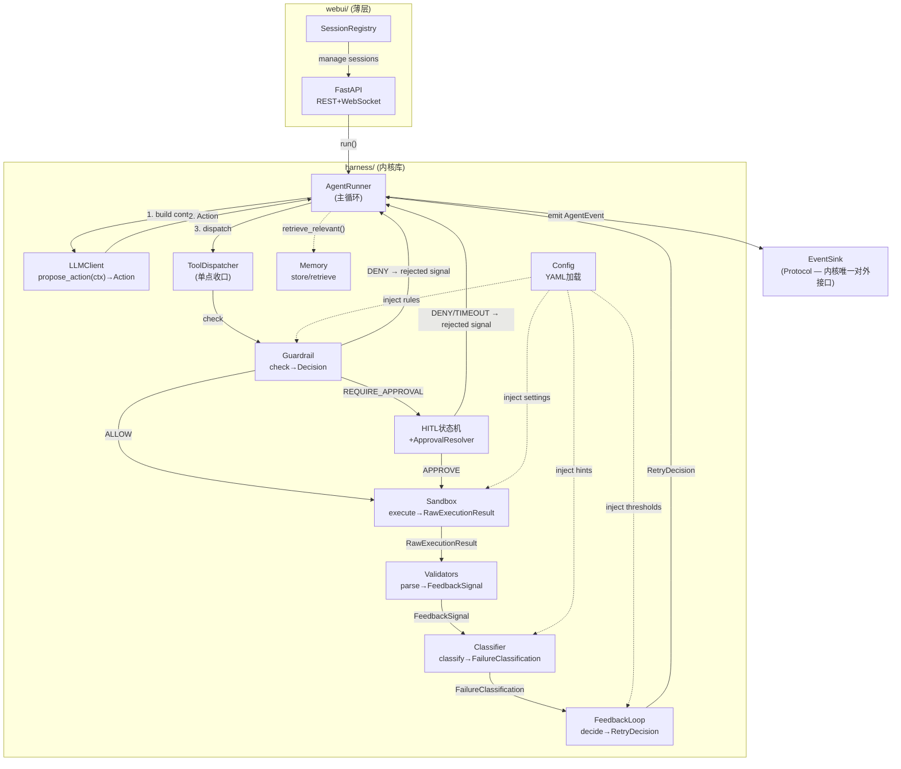

# SPEC.md — Coding Agent Harness

> AI4SE 期末项目 · A · Coding Agent Harness
>
> 本文件由 brainstorming 技能协作产出,涵盖通用要求 §4.2 的 10 项 + A 文件 §A.5 领域与机制设计。
>
> 日期:2026-07-16

---

## 1. 问题陈述

### 1.1 要解决什么问题

核心等式是 **Agent = LLM + Harness**。LLM 相当于 CPU,只负责"决定下一步做什么"这一行任务决策;其余都是工程:把一个只会产生下一步设想的 LLM,封装成一台能稳定、可靠工作的系统。

本项目实现一个 **coding agent harness 内核**——从零构建主循环、工具分发、治理护栏、反馈闭环、记忆与配置,不架在 LangChain/AutoGen/CrewAI 等现成 agent 框架的高层循环之上。harness 面向软件开发场景:能读写代码、执行命令、运行测试,并根据测试结果自我修正。

### 1.2 目标用户

- 想委托常规 coding 任务(如修复失败测试、实现小功能)给自主 agent 的开发者。
- 研究 agent harness 工程方法学的学生与研究者。

### 1.3 为什么值得做

当 LLM 能完成大部分"思考"时,工程师的价值落在 harness 这层工程(治理、反馈、上下文、安全、分发)。本项目通过"用一个 harness 去造另一个 harness",对这套方法论形成第一手的批判性理解。

重点深入**反馈闭环**:确定性校验器(解析 pytest/ruff/mypy 输出)+ 失败分类法 + 跨轮次失败集合对比 + 多轮自我修正。这是 coding agent 能基于客观信号自我修正的核心机制——每个机制都落实为确定性代码,移除真实 LLM 后仍可用单测验证(呼应 A.4-C 判据)。

---

## 2. 用户故事

遵循 INVEST 原则(Independent / Negotiable / Valuable / Estimable / Small / Testable)。

### US1 — 自主编码

> 作为开发者,我想下达一个 coding 任务(如"修复这个失败的测试"),让 agent 自主读写文件、跑测试、据反馈自我修正,直到完成——这样我能委托常规编码工作。

**验收**:agent 能在沙箱工作区内完成"读文件→改代码→跑测试→据反馈修正→测试通过"的完整闭环。

### US2 — 客观反馈

> 作为开发者,我想 agent 的每轮修正都基于客观信号(测试/lint/类型检查的解析结果)而非 LLM 自评——这样我能信任其输出经过验证。

**验收**:反馈信号由确定性 validator 代码解析工具输出产生,而非提示词让 LLM 自检。

### US3 — 危险拦截

> 作为开发者,我想危险命令(rm -rf 等)被拦截并要求我审批——这样 agent 不会破坏我的系统。

**验收**:`guardrail(Action(RunShell, "rm -rf /"))` 确定性返回 DENY;REQUIRE_APPROVAL 类动作经 HITL 状态机暂停等待审批。

### US4 — 实时可观测

> 作为开发者,我想通过 WebUI 实时看 agent 的每步推理、工具调用、反馈信号、HITL 审批——这样我能监控并在必要时介入。

**验收**:WebUI 经 WebSocket 实时推送 AgentEvent 流;HITL 审批框可交互;断线可重连回放。

### US5 — 停滞检测

> 作为开发者,我想反馈闭环检测到 agent 原地踏步/震荡时自动升级而非无限循环——这样它不会在无解问题上空转。

**验收**:跨轮次失败集合对比检测到"原地踏步"或"震荡"时,在固定阈值前提前触发 ESCALATE。

### US6 — 安全凭据

> 作为新用户,我想首次运行时安全录入 API key 并存入系统钥匙串,查看状态不回显明文——这样我的凭据不被暴露。

**验收**:keyring 存储;首次运行 getpass 引导;`show-key` 只显 set/not set;沙箱 env 白名单确保 agent 命令读不到 key。

### US7 — 声明式配置

> 作为维护者,我想通过 YAML 配置护栏规则与反馈阈值而无需改代码——这样能定制 agent 行为。

**验收**:guardrail 规则、feedback 阈值、sandbox 设置、LLM 设置均从 YAML 加载;改配置不改代码即可调整行为。

---

## 3. 功能规约

按模块拆分。每项描述输入 / 行为 / 输出 / 边界条件 / 错误处理。

### 3.1 Agent Runner(主循环)

**职责**:组织上下文 → 调用 LLM → 解析动作 → 治理拦截 → 分发工具 → 反馈验证 → 回灌结果 → 停机判断。

| 项 | 说明 |
|---|---|
| 输入 | `task: str`(用户任务描述)、`workspace: Workspace`、`llm_client: LLMClient`、`event_sink: EventSink`、`config: Config` |
| 行为 | 循环执行上述八步,每步 emit 对应 AgentEvent;遇 HITL 则 await ApprovalResolver |
| 输出 | emit 事件流;最终 emit `LoopFinished` |
| 边界 | 最大迭代数(可配,默认 20);workspace 路径限定 |
| 错误 | LLM 解析失败 → 生成错误 FeedbackSignal 回灌;工具异常 → 捕获为 ActionResult.error 回灌 |

**关键约束**:主循环是自己实现的,不架在 AgentExecutor/AutoGen/CrewAI/LlamaIndex agent/某 SDK 自带 runner 之上(A.4-A)。

#### 3.1.1 Context 构建策略

主循环第一步"组织上下文"的三个工程决策:

**① 历史消息截断**:保留最近 N 条消息(可配,默认 20)。超限时,优先丢弃最旧的非反馈消息(保留最近的 FeedbackSignal 与工具结果,因为它们是自我修正的依据)。截断策略是确定性代码——`truncate_history(history, max=20)` 可单测。

**② 反馈信号格式化**:FeedbackSignal 以**结构化文本摘要**嵌入 context(非原始 JSON),格式由确定性格式化函数生成:

```
[FEEDBACK] source=pytest, passed=false
  Failures:
    - test_foo.py::test_bar: assert 1==2
  Classification: ASSERTION_FAILURE
  Hint: The test ran but the assertion failed. Check the logic in the failing test.
  RetryDecision: RETRY_SAME (attempt 3/20)
```

格式化函数 `format_feedback(signal, classification, decision) -> str` 是代码,可单测:传入构造的 signal → 断言输出文本包含预期字段。

**③ 记忆按需检索**:主循环**自动**检索,无需 LLM 通过 action 请求。检索逻辑:对 task 文本做关键词匹配,从 memory store 中 retrieve 匹配的条目,注入 `Context.memory_items`。检索函数 `retrieve_relevant(task, memory_store) -> list[MemoryItem]` 是确定性代码,可单测:构造 memory + task → 断言返回匹配项。

#### 3.1.2 停机判定

三层停机机制:

1. **LLM 主动 Done**:LLM 返回 `Done(summary)` → 立即停止。
2. **自动 Done**:连续 2 轮所有反馈信号(测试+lint+类型检查)均 passed=true → 自动触发 Done(不依赖 LLM 自觉)。判定函数 `should_auto_stop(feedback_history) -> bool` 是确定性代码,可单测。
3. **硬兜底**:达最大迭代数(可配,默认 20)→ ABORT。

### 3.2 LLM 抽象层

**职责**:把 Context 转成 Action,可替换为 mock(离线测试)或真实供应商。

| 项 | 说明 |
|---|---|
| 输入 | `Context`(system_prompt + history + memory_items + feedback_signals + workspace_info) |
| 行为 | `propose_action(context) -> Action`;mock 从脚本队列返回 canned actions;real 调 NJU endpoint(OpenAI 兼容),prompt 要求返回 JSON action,解析之 |
| 输出 | `Action`(结构化:type + args) |
| 边界 | Action type ∈ ReadFile/WriteFile/ListFiles/RunShell/RunTests/RunLint/RunTypeCheck/Done |
| 错误 | real client 解析失败 → 返回错误信号让 LLM 下轮修正(不崩溃);网络异常 → 重试或回灌错误 |

**接口**:`LLMClient` ABC,`propose_action(context: Context) -> Action`。MockLLMClient 与 RealLLMClient 均满足此接口。

#### 3.2.1 RealLLMClient — Prompt 骨架与 JSON Schema

**System prompt 骨架**(结构是接口契约属代码,具体措辞是内容物):

```
You are a coding agent operating in a sandboxed workspace.
Available actions:
  ReadFile(path)          — read a file
  WriteFile(path, content)— write a file
  ListFiles(pattern)      — list files matching glob pattern
  RunShell(command)       — execute a shell command
  RunTests()              — run pytest
  RunLint()               — run ruff
  RunTypeCheck()          — run mypy
  Done(summary)           — signal task completion

Respond with EXACTLY ONE JSON object per turn:
  {"type": "<ActionType>", "args": {<action-specific args>}}

Do not include any text outside the JSON object.
```

**期望 JSON schema**:

```json
{"type": "WriteFile", "args": {"path": "src/foo.py", "content": "def foo(): pass"}}
{"type": "RunTests", "args": {}}
{"type": "Done", "args": {"summary": "Fixed the failing test"}}
```

每个 action type 有对应的 args schema:`ReadFile{path:str}`、`WriteFile{path:str, content:str}`、`ListFiles{pattern:str}`、`RunShell{command:str}`、`RunTests{}`、`RunLint{}`、`RunTypeCheck{}`、`Done{summary:str}`。

**解析失败回灌格式**:RealLLMClient 解析失败时生成:

```
FeedbackSignal(
  source="llm",
  passed=False,
  failures=[FailureItem(loc="llm_response", message="Non-JSON response: <截断至200字符>", category="UNKNOWN")],
  summary="LLM returned non-JSON response",
  raw="<原始响应>",
  reason="llm_parse_error"
)
```

此 FeedbackSignal 经标准反馈路径回灌,LLM 下一轮据此修正输出格式。解析逻辑(`parse_action_response(raw) -> Action | FeedbackSignal`)是代码,可单测:传入伪造的非 JSON 文本 → 断言返回 `llm_parse_error` 信号。

#### 3.2.2 MockLLMClient — MockScript 格式

两种确定性模式,均无网络无真实 LLM:

**队列模式**(简单场景):
```python
MockLLMClient(actions=[
    WriteFile(path="src/foo.py", content="def foo(): pass"),
    RunTests(),
    Done(summary="Done"),
])
# 按序返回,耗尽则抛 MockExhaustedError
```

**响应器模式**(条件场景,机制演示用):
```python
MockLLMClient(responder=lambda ctx: (
    FixAction() if has_failure_feedback(ctx) else Done(summary="All pass")
))
# 接收 Context,返回 Action;可据 feedback_signals 做条件分支
```

两种模式均可被单测直接构造,脚本可被独立审查。

### 3.3 工具分发(ToolDispatcher)

**职责**:单点收口所有工具调用,内部固定顺序 `guardrail.check → sandbox.execute`。

| 项 | 说明 |
|---|---|
| 输入 | `Action` |
| 行为 | 三分支:ALLOW→sandbox.execute;DENY→生成 `FeedbackSignal(rejected, reason="guardrail_denied")` 回灌;REQUIRE_APPROVAL→转交 HITL 状态机 |
| 输出 | `ActionResult` 或 `FeedbackSignal`(rejected) |
| 边界 | 各 tool 文件只实现执行逻辑,不得各自做护栏判断(§1 约定①) |
| 错误 | sandbox 执行异常 → ActionResult.error |

**工具集**:
- `ReadFile(path)` / `WriteFile(path, content)` / `ListFiles(pattern)` — 路径限定 workspace
- `RunShell(command)` — 通用 shell,沙箱化
- `RunTests()` / `RunLint()` / `RunTypeCheck()` — 产出 `RawExecutionResult` 交 validators(§1 约定②)

### 3.4 治理(Guardrail / Sandbox / HITL)

非重点维度,需扎实最低实现 + 满足机制演示①。

#### 3.4.1 Guardrail(规则引擎)

| 项 | 说明 |
|---|---|
| 输入 | `Action` |
| 行为 | 遍历可配置规则集,匹配则返回对应 Decision;无匹配 → ALLOW |
| 输出 | `Decision = ALLOW \| DENY(reason) \| REQUIRE_APPROVAL(reason)` |
| 边界 | 规则从 config 加载(声明式);内置:命令黑名单(rm -rf / git push --force / fork 炸弹等正则)、路径越界(读写 workspace 外→DENY)、危险模式(sudo/chmod 777 等) |
| 错误 | 规则解析失败 → 默认 DENY(安全侧失效) |

**单测**:`guardrail(Action(RunShell, command="rm -rf /"))` → DENY,每次成立,无 LLM。

#### 3.4.2 Sandbox(执行隔离)

| 项 | 说明 |
|---|---|
| 输入 | `Action`(经 guardrail ALLOW 后) |
| 行为 | RunShell:subprocess + cwd 锁定 workspace + **env 白名单**(仅 PATH/HOME/LANG 等,非"父进程减黑名单")+ 超时;文件工具:路径解析限定 workspace(拒绝 `../` 越界) |
| 输出 | `RawExecutionResult(exit_code, stdout, stderr)` |
| 边界 | checkpoint:快照工作区状态(为 REVERT stretch goal 预留,本迭代可选) |
| 错误 | 超时 → RawExecutionResult 标记 timeout;路径越界 → 拒绝执行 |

**凭据隔离归属**:沙箱 env 白名单防止 agent 命令读取 harness 自身 LLM 凭据——此隔离属于 Governance 机制,不是独立凭据机制。

#### 3.4.3 HITL 状态机

| 项 | 说明 |
|---|---|
| 输入 | `REQUIRE_APPROVAL` Decision |
| 行为 | 状态迁移:`IDLE → PENDING_APPROVAL → (APPROVED\|DENIED\|TIMEOUT) → IDLE`;emit `HitlApprovalRequired` → await `ApprovalResolver` |
| 输出 | APPROVE→sandbox.execute;DENY→生成 `FeedbackSignal(rejected, reason)` 回灌;TIMEOUT→复用 DENY 逻辑(reason="approval_timeout")+ 清理沙箱工作区 |
| 边界 | ApprovalResolver 是 Future-like,由 webui 层在用户决策时 resolve;单测注入同步 stub;审批超时默认 300s(可配) |
| 错误 | "审批一直不 resolve"已闭合:TIMEOUT 终态生成 rejected 信号 + 清理 |

**语义澄清**:HITL 拒绝与 guardrail DENY 共用同一 `FeedbackSignal(rejected)` 形状,仅 reason 不同——治理决策与测试失败共享同一条反馈回灌路径。

### 3.5 反馈闭环(★ 重点维度 — 主要贡献)

这是项目的 main contribution,做到足够深入。三段式管线,每段都是确定性代码、可独立单测:

```
RawExecutionResult ──① Validators ──> FeedbackSignal
                                            │
                              ② Classifier ──> FailureClassification
                                            │
                              ③ FeedbackLoop ──> RetryDecision
                                            │
                                   (回灌进 context)
```

#### 3.5.1 Validators(解析器)

| 项 | 说明 |
|---|---|
| 输入 | `RawExecutionResult`(exit_code, stdout, stderr) |
| 行为 | PytestValidator/RuffValidator/MypyValidator 各解析一种工具输出;优先用 JSON/结构化输出格式,降级到文本解析 |
| 输出 | `FeedbackSignal(source, passed: bool, failures: list[FailureItem], summary, raw, reason)` |
| 边界 | `RawExecutionResult` 是 feedback_tools 与 validators 之间的显式契约(§1 约定②) |
| 错误 | 解析失败 → FeedbackSignal(passed=False, category=UNKNOWN) |

**单测**:`PytestValidator.parse(RawExecutionResult(exit_code=1, stdout="<伪造 pytest 输出>"))` → 断言 `passed=False, failures=[FailureItem(loc="test_foo.py::test_bar", msg="assert 1==2")]`。无 LLM、无网络、无真实 pytest。

#### 3.5.2 Classifier(失败分类法)

| 项 | 说明 |
|---|---|
| 输入 | `FeedbackSignal` |
| 行为 | 纯函数:将原始失败映射到可操作类别;一个 signal 内多类失败按优先级归并 |
| 输出 | `FailureClassification(category, hint, priority)` |
| 边界 | emit `FailureClassified(classification)` 事件 |
| 错误 | 无法分类 → UNKNOWN |

**分类法**(每类暗示不同修法,可操作):
- `COLLECTION_ERROR` / `IMPORT_ERROR` / `SYNTAX_ERROR` — 代码无法加载运行
- `TIMEOUT` — 命令超时
- `TYPE_ERROR` — mypy 类型违例
- `ASSERTION_FAILURE` — 跑通了但断言失败,逻辑错
- `LINT_VIOLATION` — ruff 风格/约定
- `UNKNOWN` — 未分类

**优先级归并**:`COLLECTION_ERROR/IMPORT_ERROR/SYNTAX_ERROR > TIMEOUT > TYPE_ERROR > ASSERTION_FAILURE > LINT_VIOLATION`。存在高优先级类别时整体归为该类。

`hint` 是回灌给 LLM 的结构化提示片段。**来源机制**:hint 模板从 config YAML 加载,按 category 键索引:

```yaml
hints:
  ASSERTION_FAILURE: "The test ran but the assertion failed. Check the logic in the failing test."
  IMPORT_ERROR: "A module could not be imported. Check import paths and dependencies."
  SYNTAX_ERROR: "The code has a syntax error and cannot be parsed."
  # ...
```

Classifier 逻辑(category → 查哪个 hint key)是代码;hint 文本本身是内容物(配置)。**可测试性**:`classify(signal).category == ASSERTION_FAILURE` 每次都成立,与 hint 文本无关——换掉 hint 文本不影响分类断言。

#### 3.5.3 FeedbackLoop 控制器(重试/升级策略)

| 项 | 说明 |
|---|---|
| 输入 | `FeedbackSignal` + `FailureClassification` + `attempt_count` + 历史失败集合 |
| 行为 | 纯函数:决定重试策略;跨轮次失败集合对比判断态势 |
| 输出 | `RetryDecision(strategy, attempt_count, max)` |
| 边界 | emit `RetryDecision(...)` 事件;阈值可配置 |
| 错误 | 达最大迭代 → ABORT |

**策略空间**:
- `RETRY_SAME` — 带反馈重试
- `ESCALATE` — 同类失败超阈值或检测到停滞/震荡 → 升级(要求更多上下文或换策略)
- `ABORT` — 达最大迭代;可选地转化为一次 HITL 请求(与"HITL 拒绝→反馈信号回灌"原则对称)
- `REVERT` — 回滚到 sandbox checkpoint(**预留 stretch goal,本迭代不实现**)

**跨轮次失败集合对比**:按 `FailureItem.loc` 指纹做交集/新增/消失判断,区分三种态势:
- **收敛**:失败项在减少 → RETRY_SAME
- **原地踏步**:不变 → 提前触发 ESCALATE(不必等固定阈值)
- **震荡**:消失后复现 → 提前触发 ESCALATE

**语义澄清**:`ESCALATE` 保持全自动(不触发 HITL);只有 `ABORT` 可选地转化为一次 HITL 请求。

#### 3.5.4 在主循环中的位置

agent 调 `RunTests/RunLint/RunTypeCheck` → ToolDispatcher → sandbox 执行 → `RawExecutionResult` → 对应 Validator → `FeedbackSignal` → Classifier → `FailureClassification` → FeedbackLoop → `RetryDecision` → 三者打包回灌 context → LLM 下一轮 `propose_action`。

**为什么够深(对齐 A.4)**:多信号源各有确定性解析器;分类法把原始失败映射到可操作类别并按优先级归并;重试策略可配置可观测;跨轮次失败集合对比检测收敛/停滞/震荡;整条管线事件驱动,注入录制用 EventSink 即可断言完整事件序列;与治理共享反馈回灌路径。移除 LLM 后,①②③每段都能用伪造输入确定性单测。

### 3.6 记忆(最低实现)

| 项 | 说明 |
|---|---|
| 输入 | `key: str`, `value: str` |
| 行为 | 键值存储:`store(key, value)` / `retrieve(key)` / `list_keys()`;持久化到 workspace 内 `.harness/memory.json`,跨会话可恢复 |
| 输出 | 存储确认 / 检索值 / 键列表 |
| 边界 | 主循环自动 retrieve 相关条目(§3.1.1③)而非全量载入 context |
| 错误 | 文件损坏 → 空记忆,不崩溃 |

**单测**:`store("convention","use pytest")` → `retrieve("convention")` 断言,无 LLM。

### 3.7 配置(声明式)

| 项 | 说明 |
|---|---|
| 输入 | YAML 配置文件 |
| 行为 | 启动时加载,注入各组件 |
| 输出 | `Config` 对象 |
| 边界 | 节:guardrail 规则、feedback 阈值(每类失败最大重试、升级阈值)、sandbox 设置(超时、env 白名单)、LLM 设置(model/temperature) |
| 错误 | 配置缺失 → 使用默认值 + 警告;配置非法 → 启动失败 + 明确错误信息 |

**单测**:加载配置 → 断言护栏规则被正确解析。

### 3.8 WebUI

| 项 | 说明 |
|---|---|
| 输入 | 用户经浏览器下达 coding 任务 / HITL 审批决策 |
| 行为 | FastAPI 后端:REST 端点(建会话、HITL 审批)+ WebSocket(实时推送 agent 循环事件);前端:轻量(vanilla HTML/JS 或 HTMX) |
| 输出 | 实时事件流可视化;HITL 审批框;会话历史 |
| 边界 | SessionRegistry 管理 WebSocket 重连(§1 约定③);内核只暴露 EventSink 接口,不管理连接 |
| 错误 | WebSocket 断线 → SessionRegistry 回放缓冲事件 + 续推实时事件 |

**界面**:下达 coding 任务 → 实时看 agent 每步(工具调用/反馈信号/HITL 审批框/记忆/日志)→ 触发机制演示。

**Open Design 豁免**:本项目以 harness 内核为主体,WebUI 是演示/可视化层而非前端项目。

#### 3.8.1 REST 端点

| 方法 | 路由 | 说明 |
|---|---|---|
| POST | `/sessions` | 创建会话(body: `{task: str, seed?: str}`) |
| GET | `/sessions/{id}` | 查询会话状态(running/pending_approval/done/aborted) |
| POST | `/sessions/{id}/approve` | HITL 审批(body: `{decision: "approve"\|"deny"}`) |
| GET | `/sessions/{id}/stream` | WebSocket 升级,实时推送 AgentEvent 流 |
| POST | `/sessions/{id}/abort` | 用户中止会话 |

#### 3.8.2 并发会话行为

- 每个会话有**独立临时工作区**(temp 目录,互不冲突)
- 最大并发会话数可配(默认 5);超出 → HTTP 429
- SessionRegistry 以 session_id 索引运行中循环 + 事件缓冲

### 3.9 凭据管理

| 项 | 说明 |
|---|---|
| 输入 | 用户首次运行录入 / CLI 命令 |
| 行为 | keyring 存储;首次运行 getpass 隐藏输入引导;`show-key`(显状态不回显)/ `set-key`(隐藏输入更新)/ `clear-key`(清除) |
| 输出 | key 状态 / 存储确认 / 清除确认 |
| 边界 | 加载优先级:keyring → env var(云部署)→ .env(开发用,明文) |
| 错误 | keyring 不可用 → 降级到 env var + 警告 |

详见 §7 凭据与分发设计。

---

## 4. 非功能性需求

### 4.1 性能

- 每轮迭代延迟由 LLM API 主导;sandbox 命令超时可配(默认 30s)
- 单会话最大迭代可配(默认 20)
- WebSocket 事件低延迟推送 + 缓冲回放

### 4.2 安全(含凭据威胁模型)

**五条安全原则**:
1. Secret never enters source code
2. Secret never enters logs
3. Secret never enters git
4. Secret never enters agent tool environment(沙箱 env 白名单)
5. Secret access is controlled by Harness, not LLM——LLM 抽象层内部用 key 调 API;agent 提议的 Action 从不接触凭据;harness 是凭据的唯一持有者与使用者

**凭据威胁模型(单 key 生命周期)**:

| 威胁 | 向量 | 对策 |
|---|---|---|
| 源码硬编码 | 写死在 .py | 永不硬编码;运行时从 keyring/env 加载 |
| Git 历史 | 提交 .env/配置 | `.env` 入 `.gitignore`;用 keyring;pre-commit 自查 |
| 日志泄露 | 打印到 stdout/log | 永不 log key;status 只显 set/not set |
| Shell history | `export KEY=...` | 用 keyring + getpass,不用 export |
| 沙箱命令读取 harness 凭据 | agent 的 RunShell 读进程 env | sandbox env 白名单:仅传 PATH/HOME/LANG,key 不在子进程可见 |
| 异常消息泄露 | traceback 含 key | 错误消息脱敏,不含 key |
| 云部署共享主机 | 多用户/进程可见 env | 平台 secret 管理 + env 白名单隔离;文档说明明文风险 |

**凭据隔离归属**:沙箱 env 白名单防止 agent 命令读取 harness 凭据——此隔离属于 Governance 机制(`governance/sandbox.py`)。`credman/` 只负责存储/加载,隔离执行由 governance 承担。

### 4.3 可用性

- WebUI:实时可视化 agent 循环,界面清晰
- CLI:`harness run "task description"` 简洁
- 首次运行:引导式 key 录入

### 4.4 可观测性

- 全程事件流:每步 emit AgentEvent
- 结构化日志(不含 secret)
- WebUI 可查会话历史

---

## 5. 系统架构

### 5.1 拓扑

Web 优先(Approach A):FastAPI 后端 + WebUI 前端。harness 内核是一个可导入的 Python 库(`harness/`),后端在进程内调用它。每个会话有一个临时沙箱工作区(cwd 锁定、命令护栏、超时),agent 在其中读写文件、跑测试。

### 5.1.1 组件关系图



**调用方向说明**:AgentRunner 是唯一驱动者——它调 LLM 获取 Action,经 ToolDispatcher 分发(内含 Guardrail→Sandbox 固定顺序),将 Sandbox 产出的 RawExecutionResult 送入反馈管线(Validators→Classifier→FeedbackLoop),三者结果打包回灌 Context。EventSink 是内核唯一对外接口,webui 层通过它订阅事件。Config 以依赖注入方式配置各组件,无循环依赖。

### 5.2 数据流

用户经 WebUI 下达 coding 任务 → 后端建会话 + 沙箱 → Agent Runner 循环(组上下文→调 LLM→解析 Action→治理拦截→分发工具→反馈验证器解析→回灌→停机判断),每步经 WebSocket 实时推送到前端;HITL 动作暂停等待 WebUI 审批。

### 5.3 会话生命周期

| 阶段 | 触发 | 行为 |
|---|---|---|
| 创建 | `POST /sessions {task, seed?}` | 建 session_id + 新沙箱工作区 + AgentRunner;注册进 SessionRegistry |
| 运行 | `AgentRunner.run()` 启动 | 循环每步 emit 事件 → WebSocketBroadcastSink 扇出给订阅者 + 缓冲近期事件 |
| HITL 暂停 | 护栏判定 `require-approval` | emit `HitlApprovalRequired` → 循环 await ApprovalResolver(Future-like);前端弹审批框 |
| 审批恢复 | `POST /sessions/{id}/approve` | webui 解析 Future → 循环据决策继续/中止 |
| 结束 | 测试通过/超迭代/agent done/用户中止 | emit `LoopFinished` → 工作区进入保留期 → 标记 done |
| 重连 | WebSocket 断线后 `GET /sessions/{id}/stream` | SessionRegistry 仍有运行中循环 → 回放缓冲事件 + 续推实时事件 |

**工作区保留策略**:session 结束后工作区**保留可配时长**(默认 1 小时),期间 WebUI 可下载工作区内容/diff 供回看 agent 修改了什么。保留期满后删除。保留期清理是 webui 层职责(定时任务),内核不参与。

### 5.4 内核事件接口

内核不感知 WebUI/WebSocket。`AgentRunner.run()` 接收一个 `EventSink`(Protocol),每步 `emit(AgentEvent)`。

**事件类型**:`LoopStarted`、`ContextBuilt`、`LLMProposed(action)`、`GuardrailDecision(action, verdict)`、`ToolCallStarted`、`ToolCallResult`、`FeedbackSignalEmitted(FeedbackSignal)`、`FailureClassified(classification)`、`RetryDecision(strategy, attempt_count)`、`HitlApprovalRequired(action)`、`LoopStep`、`LoopFinished`。

> **命名消歧**:事件类型命名为 `FeedbackSignalEmitted(FeedbackSignal)` 以区分数据模型 `FeedbackSignal`。前者是事件(emit 给 EventSink),后者是数据载体(validator 产出的结构化对象)。

单测时传入录制用 EventSink(或直接断言事件列表),完全离线、确定性。

**关键边界**:SessionRegistry、WebSocket 连接管理、事件缓冲与回放,全部在 `webui/` 层。内核的 `AgentRunner` 只认 `EventSink` 接口和(可选的)`ApprovalResolver`——后者是一个 awaitable,由 webui 层在收到审批时 resolve。内核在单测里可注入同步 resolve 的 stub,完全脱离网络。

### 5.5 模块边界

```
harness/                    # 内核库(交付主体)
  agent_runner.py           # 主循环
  llm/                      # LLM 抽象层
    base.py                 #   LLMClient ABC: propose_action(context)->Action
    mock_client.py          #   mock 实现(离线测试用)
    real_client.py          #   真实实现(NJU endpoint)
  tools/                    # 工具分发
    base.py                 #   Tool ABC + ToolDispatcher
    file_tools.py           #   ReadFile/WriteFile/ListFiles
    shell_tool.py           #   RunShell(通用)
    feedback_tools.py       #   RunTests/RunLint/RunTypeCheck(产出 RawExecutionResult)
  governance/               # 治理
    guardrail.py            #   guardrail(action)->Decision
    sandbox.py              #   工作区沙箱(cwd/env 白名单/超时)
    hitl.py                 #   HITL 审批状态机
  feedback/                 # ★ 重点维度
    validators.py           #   PytestValidator/RuffValidator/MypyValidator
    classifier.py           #   失败分类法 + 优先级归并
    feedback_loop.py        #   反馈闭环控制器(重试/升级/停滞检测)
    models.py               #   FeedbackSignal/FailureClassification/RetryDecision
  memory/store.py           # 记忆(最低实现)
  config.py                 # 声明式配置(护栏策略等)
  models.py                 # Action/ActionResult/RawExecutionResult/Context/Session/AgentEvent
webui/                      # FastAPI + 前端(薄层)
  app.py                    #   FastAPI app
  routes.py                #   REST/WebSocket 端点
  session_registry.py      #   会话状态注册表(WebSocket 重连)
  static/                   #   前端资源
cli.py                      # 薄 CLI 前端(也调 harness 库)
credman/store.py            # 凭据安全存储(keyring)
tests/                      # mock-LLM 单测 + 机制演示
```

### 5.6 设计纪律(三条约定)

1. **工具调用单点收口**:所有工具调用必须经 `ToolDispatcher` 单一入口,内部固定顺序 `guardrail.check(action) → (通过则) sandbox.execute(action)`。各 tool 文件只实现执行逻辑,不得各自做护栏判断。
2. **反馈契约显式化**:`tools/feedback_tools.py` 与 `feedback/validators.py` 之间以 `harness/models.py` 中的 `RawExecutionResult` 类为显式契约——feedback_tools 产出 RawExecutionResult,validators 消费它。validators 可用伪造的 RawExecutionResult 文本离线单测,无需真正跑测试。
3. **会话状态归属 webui 层**:session 状态注册表(WebSocket 重连找回运行中循环)是 webui 层职责;内核只暴露事件订阅接口(EventSink),不管理连接、不感知 WebSocket。

### 5.7 外部依赖

- LLM 供应商:NJU endpoint(`https://njusehub.info/v1`,OpenAI 兼容)
- Python 库:fastapi, uvicorn, keyring, pytest, ruff, mypy, httpx(openai SDK)
- 部署平台:Render / Railway / Fly.io(免费额度优先)
- 容器:Docker

---

## 6. 数据模型

### 6.1 核心实体

```
Action              = ReadFile|WriteFile|ListFiles|RunShell|RunTests|RunLint|RunTypeCheck|Done (+ args)
ActionResult         = {success: bool, output: str, error: str | None}
RawExecutionResult   = {exit_code: int, stdout: str, stderr: str}     # feedback_tools ↔ validators 契约
FeedbackSignal       = {source: str, passed: bool, failures: [FailureItem], summary: str, raw: str, reason: str}
FailureItem          = {loc: str, message: str, category: str}
FailureClassification = {category: str, hint: str, priority: int}
RetryDecision        = {strategy: RETRY_SAME|ESCALATE|ABORT|REVERT*, attempt_count: int, max: int}
Decision             = ALLOW | DENY(reason) | REQUIRE_APPROVAL(reason)
Context              = {system_prompt: str, history: [Message], memory_items: [MemoryItem],
                        feedback_signals: [FeedbackSignal], workspace_info: WorkspaceInfo}
AgentEvent           = LoopStarted|ContextBuilt|LLMProposed|GuardrailDecision|ToolCallStarted|
                      ToolCallResult|FeedbackSignalEmitted|FailureClassified|RetryDecision|
                      HitlApprovalRequired|LoopStep|LoopFinished
Session              = {id: str, task: str, workspace: Workspace, state: str}
GuardrailRule        = {name: str, pattern: str, action_type: type, verdict: Decision, reason: str}
Config               = {guardrail_rules: [GuardrailRule], feedback_thresholds: dict,
                        sandbox_settings: dict, llm_settings: dict}

(* REVERT 为预留 stretch goal,本迭代不实现)
```

#### 6.1.1 字段约束

| 实体 | 字段 | 类型 | 约束 |
|---|---|---|---|
| Action | type | enum | 必填;∈ {ReadFile, WriteFile, ListFiles, RunShell, RunTests, RunLint, RunTypeCheck, Done} |
| Action | args | dict | 必填;schema 随 type 变化(见 §3.2.1) |
| RawExecutionResult | exit_code | int | 必填 |
| RawExecutionResult | stdout | str | 必填;可为空 |
| RawExecutionResult | stderr | str | 必填;可为空 |
| FeedbackSignal | source | str | 必填;∈ {pytest, ruff, mypy, llm, guardrail, hitl} |
| FeedbackSignal | passed | bool | 必填 |
| FeedbackSignal | failures | list[FailureItem] | 必填;passed=true 时为空列表 |
| FeedbackSignal | reason | str | 可选;rejected 信号必填,∈ {guardrail_denied, approval_denied, approval_timeout, llm_parse_error} |
| FailureItem | loc | str | 必填;失败位置指纹(文件路径::测试名 或 llm_response) |
| FailureItem | category | str | 必填;∈ §3.5.2 分类法枚举 |
| FailureClassification | category | str | 必填;∈ §3.5.2 分类法枚举 |
| FailureClassification | priority | int | 必填;数值越小优先级越高 |
| RetryDecision | strategy | enum | 必填;∈ {RETRY_SAME, ESCALATE, ABORT, REVERT*} |
| RetryDecision | attempt_count | int | 必填;≥1 |
| RetryDecision | max | int | 必填;≥1 |
| Session | state | str | 必填;∈ {running, pending_approval, done, aborted} |
| Config | 各字段 | — | 见 §3.7;缺失时使用默认值 |

### 6.2 实体关系

- `Session` 1—1 `Workspace`(每会话一个沙箱工作区)
- `Session` 1—* `AgentEvent`(会话产生事件流)
- `Action` →经→ `Decision`(guardrail 判定)→若 ALLOW→ `RawExecutionResult`(sandbox 执行)
- `RawExecutionResult` →经→ `FeedbackSignal`(validator 解析)→ `FailureClassification`(classifier)→ `RetryDecision`(feedback loop)
- `FeedbackSignal(rejected)` 由 guardrail DENY 或 HITL DENY/TIMEOUT 生成(共享形状,reason 不同)

---

## 7. 凭据与分发设计

### 7.1 凭据存储方案

**凭据系统**:
- **Local**:`keyring`(OS 钥匙串:Windows Credential Manager / macOS Keychain / Linux Secret Service)
- **Cloud**:平台注入的 secret 环境变量
- **Fallback**:`.env`(仅开发用,明文,`.gitignore`,加载时打印风险警告)

**加载优先级**:keyring → env var → .env

**录入/更新/清除流程**:
- 首次运行:检测无 key → `getpass` 隐藏输入引导录入 → 存入 keyring → 发一次测试 API 调用验证
- `config show-key`:显示状态(set/not set),不回显明文
- `config set-key`:隐藏输入更新 keyring
- `config clear-key`:从 keyring 清除

**云部署特例**:keyring 在云端无交互式钥匙串,故用平台注入的 env var。harness 的 credential loader 先查 keyring,空则查 env var。沙箱白名单确保 agent 子进程读不到该 env——这是云部署下最关键的防线。

### 7.2 分发形态

Docker 容器:
- `Dockerfile`:Python 基础镜像 + 依赖 + 前端静态资源 + harness 库
- 单条 `docker build` + 单条 `docker run` 启动(暴露端口,env 注入 key)
- 推送到公开 registry(GitHub Container Registry / Docker Hub)
- README 写清获取、运行、key 在目标机安全配置、已知限制

### 7.3 key 在目标机的安全配置方式

- 本地:首次运行引导录入 → keyring
- 云部署:平台 secret 管理注入 env var → harness 从 env 加载 → 沙箱白名单隔离

### 7.4 CI/CD 流水线

```
push → GitLab CI
  ├─ unit-test job:  pytest(全离线 mock-LLM 单测)         ← 每次 push 必跑
  └─ build-image job: docker build → push to registry     ← main 分支触发
                                                          ↓
                      Render/Railway 自动拉取新镜像 → 部署  ← registry webhook
```

- `unit-test`:每次 push 运行 `pytest`,全离线,不依赖网络与真实 LLM
- `build-image`:main 分支 push 时构建 Docker 镜像,推送到 GitHub Container Registry
- **部署**:Render/Railway 配置 registry webhook,检测到新镜像 tag 自动拉取部署
- 最后一次 CI/CD 执行必须 pass

---

## 8. 技术选型与理由

| 选型 | 选择 | 理由 |
|---|---|---|
| 语言 | Python | pytest 写确定性单测最省事;subprocess 跑 shell/测试天然顺手;解析 test/lint/typecheck 输出自然;keyring 库凭据存储成熟;openai SDK 生态丰富;mock 抽象层用 ABC/Protocol 极简洁 |
| Web 框架 | FastAPI | 异步支持 WebSocket;自动文档;轻量;与 Python harness 同栈 |
| 前端 | vanilla HTML/JS 或 HTMX | 聚焦 harness 可视化,不追求重前端;无构建步骤 |
| LLM 供应商 | NJU endpoint(OpenAI 兼容) | 已登录;抽象层保持供应商无关 |
| 凭据存储 | keyring | 跨平台 OS 钥匙串;成熟稳定 |
| 测试框架 | pytest | 确定性单测;mock/stub 友好;一键运行 |
| 分发 | Docker | 单命令构建运行;云部署直接复用;CI 可构建镜像 |
| CI | .gitlab-ci.yml(NJU Git 为 GitLab) | 含 unit-test job;每次 push 自动跑测试 |
| 部署平台 | Render / Railway / Fly.io | 免费额度;Docker 部署;提供公网 URL |
| 目标项目类型 | Python(pytest/ruff/mypy) | 与 harness 同语言,对称美观;解析器只需一套;demo 可直接用小 Python 项目 |

---

## 9. 验收标准

| 编号 | 标准 | 客观判定 |
|---|---|---|
| AC1 | 六个维度均有可运行最低实现 | 每个维度的核心函数在 pytest 中有至少一个 mock-LLM 单测且 pass |
| AC2 | 反馈闭环深度实现 | ① Validators/Classifier/FeedbackLoop 各有独立单测 pass;② 注入停滞序列后 FeedbackLoop 在 ≤ 配置阈值轮内触发 ESCALATE;③ 优先级归并:构造多类失败 signal 断言归为最高优先级类别 |
| AC3 | 机制演示三段确定性复现 | ① `rm -rf /` 被 guardrail DENY 且生成 rejected 信号;② 注入失败→agent 据反馈改下一步动作→伪造成功→LoopFinished;③ 停滞序列→ESCALATE 在固定阈值前触发。三段均为 pytest 用例,`pytest -k demo` 可重复运行 |
| AC4 | 核心机制有 mock-LLM 离线单测 | `pytest` 一键全 pass;测试不依赖网络与真实 LLM(无网络 mock 验证) |
| AC5 | 凭据五条安全原则落实 | ① 源码 grep 无 key 硬编码;② 日志无 key 明文;③ .gitignore 含 .env;④ sandbox 子进程 env 不含 key(单测断言);⑤ LLM Action 类型无凭据访问 |
| AC6 | Docker 可构建运行,线上 WebUI 可访问 | `docker build` + `docker run` 单命令启动;线上 URL 返回 200;HITL 审批框可交互(POST /approve 返回 200) |
| AC7 | CI pass | GitLab CI `unit-test` job 最后一次执行为 pass 状态 |

### 9.1 机制演示(A.6)

三段,在 mock LLM 下确定性复现(pytest 用例或可运行脚本):

**① 护栏拦截危险动作**:MockLLM 提议 `rm -rf /` → guardrail DENY → `FeedbackSignal(rejected, "guardrail_denied")` 回灌 → LLM 下一轮改提安全动作。

**② 注入失败→反馈闭环自我修正**:MockLLM 提议 `WriteFile(有 bug 的代码)` → `RunTests` → 伪造失败 `RawExecutionResult` → PytestValidator → `FeedbackSignal` → Classifier(`ASSERTION_FAILURE`) → FeedbackLoop(`RETRY_SAME`) → LLM 见反馈改提修复 → `RunTests` → 伪造成功 → `LoopFinished`。

**③ 重点维度确定性行为**:注入"原地踏步"失败序列(同一 `FailureItem.loc` 跨轮不变) → 断言 FeedbackLoop 在固定阈值前触发 `ESCALATE`——展示跨轮次失败集合对比的深度能力。

---

## 10. 风险与未决问题

| # | 风险/未决 | 状态/对策 |
|---|---|---|
| R1 | `REVERT` 回滚到 checkpoint | 预留策略空间,本迭代不实现,记入 stretch goal |
| R2 | 云部署 env var 明文(进程可见) | 沙箱 env 白名单隔离;文档说明;平台 secret 管理 |
| R3 | 沙箱非真正容器级隔离(无 Docker-in-Docker) | guardrails + cwd 锁 + 超时;文档标注已知限制 |
| R4 | LLM 返回非法 JSON | 解析失败→生成错误 FeedbackSignal 回灌→LLM 下轮修正 |
| R5 | WebSocket 断线期间 session 过期 | SessionRegistry + 事件缓冲回放;超时清理(可配) |
| R6 | LLM 成本/速率限制 | 最大迭代 cap;无显式成本追踪(未决) |
| R7 | 多 agent 编排 | 明确出范围(触碰 A.4 红线);单 agent 循环 |
| R8 | HITL 审批超时时长 | 已闭合(TIMEOUT→rejected 信号+清理);时长可配,调参未决 |

---

## 11. 领域与机制设计(A.5)

本节逐条回答 A 文件 §A.5 的领域与机制设计要求。

### 11.1 反馈信号

coding 领域的反馈信号是**测试/lint/类型检查的客观结果**:
- pytest:测试通过/失败、失败位置与断言信息
- ruff:lint 违规项与规则代码
- mypy:类型错误与位置

这些信号客观、确定、可回灌。由确定性 validator 代码解析工具输出(JSON 优先,文本降级)产生 `FeedbackSignal`,而非"让 LLM 自行检查"的一句提示(A.4-B)。

### 11.2 危险动作

coding 领域的危险动作及边界:
- **命令黑名单**:`rm -rf`、`git push --force`、fork 炸弹、`dd if=`、`sudo`、`chmod 777` 等(正则匹配)→ DENY 或 REQUIRE_APPROVAL
- **路径越界**:读写 workspace 外的文件 → DENY
- **网络命令**:`curl`、`wget`、`pip install` 等 → REQUIRE_APPROVAL(可配)

拦截由 `guardrail(action)` 函数实现,识别危险命令即返回拦截。测试无需真实 LLM——直接传入构造的动作,断言被拦截,每次成立(A.4-C)。

### 11.3 所需工具/动作

- 文件操作:ReadFile / WriteFile / ListFiles(路径限定 workspace)
- 通用 shell:RunShell(沙箱化)
- 反馈工具:RunTests / RunLint / RunTypeCheck(产出 RawExecutionResult 交 validators)

### 11.4 记忆需求

- 跨会话保留:项目约定、历史决策、代码库知识
- 存储:键值存储,持久化到 workspace 内 `.harness/memory.json`
- 检索:agent 按需 retrieve 而非全量载入 context
- 实现:自己实现的存储与检索(不直接用框架自带 memory)

### 11.5 重点维度

**反馈闭环**。理由:
1. 它是 coding agent 的心脏——让 agent 捕到客观失败信号并据此改下一步动作
2. 深度潜力大:多类信号源、失败分类法、优先级归并、跨轮次失败集合对比(收敛/停滞/震荡)、重试/升级策略
3. 天然由代码构成(确定性纯函数),最容易同时满足 A.4 的 (A)(B)(C) 三条判据
4. 与机制演示②完美对齐

### 11.6 机制如何落成代码

呼应 A.4 的判定标准——移除真实 LLM 后,每个机制仍能用确定性单元测试验证:

| 机制 | 代码实现 | 离线单测方式 |
|---|---|---|
| 工具分发 | ToolDispatcher(guardrail.check→sandbox.execute) | MockLLM 提议动作 → 断言调用正确工具 |
| 治理拦截 | guardrail(action)→Decision | 传入构造动作 → 断言 DENY/ALLOW |
| 反馈验证 | Validator.parse(RawExecutionResult)→FeedbackSignal | 伪造 RawExecutionResult 文本 → 断言解析结果 |
| 失败分类 | Classifier.classify(FeedbackSignal)→FailureClassification | 构造 signal → 断言类别与优先级归并 |
| 反馈闭环 | FeedbackLoop.decide(signal, classification, history)→RetryDecision | 注入失败序列 → 断言策略与停滞检测 |
| 记忆读写 | store/retrieve | 存取断言 |
| 停机判断 | AgentRunner stop condition | MockLLM 返回 Done / 超迭代 → 断言停止 |
| HITL 状态机 | hitl 状态迁移 + ApprovalResolver | stub resolver → 断言状态迁移与 rejected 信号 |

**配置文件/规则文件/Skill/提示词文件本身不算 harness 实现工作量,只是"内容物"。** hint 文本属内容物,但分类逻辑(决定给哪个 hint)是代码。
